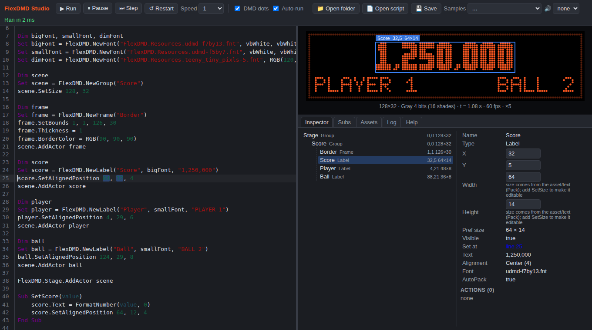

# FlexDMD Studio

A browser-based editor and live previewer for [FlexDMD](https://github.com/vbousquet/flexdmd) scenes. Write the
DMD part of a Visual Pinball table script in one pane and watch it run in the other, on macOS, Linux or Windows,
with no .NET, no COM registration and no Visual Pinball required.

**[Open the studio](https://hughfitzgerald.github.io/flexdmd-studio/)** — it runs entirely in your browser.
Scripts stay in your browser's local storage and project folders are read locally; nothing is uploaded.



FlexDMD is the DMD renderer used by Visual Pinball tables, and its designer tool is Windows-only, which makes
writing DMD scenes on a Mac awkward even though the tables themselves run fine. This project reimplements the
FlexDMD scene engine in TypeScript (actors, actions, bitmap fonts, image filters, render modes) and runs your
VBScript through a built-in interpreter, so scripts written here run unchanged in FlexDMD and in Visual Pinball.

## Running it locally

```sh
npm install
npm run dev        # http://localhost:5173
```

`npm run build` produces a static site in `dist/` that can be served from anywhere (or opened through
`npm run preview`). `npm test` runs the interpreter and engine unit tests; `npm run typecheck` runs the
TypeScript compiler.

Pushing to `main` builds and publishes to GitHub Pages; pull requests and other branches build without
deploying, since the Pages environment only accepts deployments from the default branch. On a fresh fork or
clone, enable Pages once under **Settings → Pages** with **Source: GitHub Actions**. The workflow asks to create
the site itself, but the workflow token is usually not permitted to, so the first run fails at `configure-pages`
until you have done that.

## Using it

### Three ways in

- **A scene on its own.** A `FlexDMD` object is pre-created with `Run = True`, exactly like the FlexDMDUI design
  tab, so you can write scene code straight away. Start from the Samples menu.
- **A whole table script.** Paste or open one, however large. Everything it reaches for that the previewer is not
  — the table, lights, timers, sound, the framework it is built on — is stood in for, and any line of setup that
  still fails is skipped and listed rather than stopping the run. Set **On run** to the table's init Sub (often
  `Table1_Init`) to build its DMD. A 23,000-line production table loads in well under a second.
- **Files out of a larger project.** Open the folder and tick the files you want in the **Files** tab. Frameworks
  usually split the DMD across a config file listing the scenes and a scenes file holding a `Builder` that
  constructs each scene once and a `Ticker` that updates it every frame, with the glue somewhere you have not got.
  [`examples/studio-harness.vbs`](examples/studio-harness.vbs) is that glue, small enough to read and edit.

### The run bar

- **On run** — a Sub called once after the script runs, for the table's or framework's init.
- **Each frame** — a Sub called before every frame, standing in for the table's DMD timer. `FlexFrame` counts up
  for it, so tickers that key on frame numbers behave as they do in the table. An error here stops the ticking
  rather than repeating it sixty times a second.
- **Stub unknowns** — on by default. Turn it off and every unknown name is an error again, which is what you want
  while debugging your own scene code. The **Stubs** tab lists what was stood in for, and flags names that look
  like a `Dim` left behind in a file you have not loaded.
- **Insert constants** — pastes the `FlexDMD_Align_*` / `FlexDMD_RenderMode_*` block that tables carry, so a
  script written here stays portable. The studio defines those names anyway, block or no block.

### Editing

- <kbd>Ctrl/Cmd</kbd>+<kbd>Enter</kbd> runs; <kbd>Ctrl/Cmd</kbd>+<kbd>Shift</kbd>+<kbd>Enter</kbd> runs just the
  selected lines on top of what is already loaded, without resetting the stage.
- <kbd>Ctrl/Cmd</kbd>+<kbd>/</kbd> comments or uncomments the selection.
- Completion knows the API: type `FlexDMD.` or a dot after an actor, and in an enum position (`.Alignment =`,
  `.Scaling =`, `.RenderMode =`, `.Ease =`, or the third argument of `SetAlignedPosition`) it offers the named
  constants.
- A bare enum number is labelled with what it means; click the label to write the constant instead.
- Above a few thousand lines auto-run switches itself off, so a large script is not re-run on every keystroke.

### Everything else

- **Script pane** (left): `CreateObject("FlexDMD.FlexDMD")` returns the same pre-created object, so table-style
  initialisation code works. The script re-runs as you type (toggle *Auto-run*, or press
  <kbd>Ctrl/Cmd</kbd>+<kbd>Enter</kbd>).
- **Preview** (right): the DMD frame after render mode processing (`RenderMode` 0/1 = 4/16 shades tinted with
  `FlexDMD.Color`, 2 = RGB), with an optional dot mask. *Pause*, *Step*, *Restart* and *Speed* drive the simulated
  clock that actions, GIFs and image sequences follow.
- **WYSIWYG editing**: click an actor to select it, drag to move, use the handles to resize. The literals in the
  script that produced its position and size (`SetBounds`, `SetPosition`, `SetAlignedPosition`, `SetSize`,
  `X = 10`...) are rewritten live and highlighted in the editor. Values that come from variables or expressions are
  shown read-only with an explanation in the Inspector. Arrow keys nudge the selection (<kbd>Shift</kbd> = 10 px).
  With several files loaded, only literals in the file open in the editor can be dragged.
- **Inspector**: the actor tree with live bounds, the properties of the selected actor and its pending actions.
- **Subs**: every `Sub`/`Function` in the script becomes a button, with a field for arguments written as VBScript
  literals (`1500000, "PLAYER 1", True`). Use it to fire the game events your table would fire.
- **Assets**: click *Open folder* (or drop a folder on the page) to load the folder holding your PNG/JPG/BMP/GIF/MP4
  and `.fnt` files. Script paths resolve against it, honouring `FlexDMD.ProjectFolder`. Image options work as in
  FlexDMD: `img.png&dmd=2`, `&add`, `&region=x,y,w,h`, `&pad=l,t,r,b`, and `a.png|b.png|c.png` sequences. The
  fonts bundled with FlexDMD are available under their usual `FlexDMD.Resources.` names. A file that is not there
  is replaced by a placeholder and reported in the Log, so a table whose artwork you do not have still previews.
- **Sound**: pick an audio file (ogg/mp3/wav) from the project folder; it restarts with the script and follows
  pause and speed, so you can line animations up with a soundtrack even though FlexDMD itself plays no sound.

## Checking a script from the terminal

`scripts/check-script.mjs` runs a scene headlessly and reports what happened, which is useful in CI or when
working with an agent:

```sh
node scripts/check-script.mjs scene.vbs --call DMD_Init --call "Jackpot(1500000)" --shots 0.5,2.5
```

`--each-frame "Tick()"` runs a Sub before every frame, as the table's DMD timer does, and `--strict` turns off
standing in for unknown names so they are reported as errors.

It prints syntax and runtime errors with line numbers, calls the listed Subs in order, steps the simulated clock,
dumps the actor tree (absolute bounds, visibility, pending actions) and saves screenshots at the requested times.
It exits non-zero when the script fails. Needs `npm run build` first, and a Chromium for Playwright
(`CHROMIUM_PATH` points at one).

## Writing scenes with Claude

`.claude/skills/flexdmd-scenes/` is a [Claude Code](https://claude.com/claude-code) skill for writing FlexDMD
scenes: the scene-graph and timing model, the full API reference, the engine quirks that bite, and recipes for
score layouts, attract loops, timed overlays and animated banners. It tells Claude to verify its work with the
checker above. It triggers automatically when you ask about a table's DMD in a checkout of this repository.

## What is and is not supported

Supported: the whole FlexDMD scene API (`NewGroup`, `NewFrame`, `NewLabel`, `NewImage`, `NewVideo`, `NewFont`,
`Stage`, all actor properties, `ActionFactory` with Wait, Delayed, Sequence, Parallel, Repeat, Blink, Show, AddTo,
RemoveFromParent, AddChild, RemoveChild, Seek and MoveTo with all easing modes), `RuntimeVersion` 1008/1009
semantics (label AutoPack, `Group.Get` paths), `Clear`, `DmdPixels`/`DmdColoredPixels`.

Not supported: the UltraDMD compatibility API, VPX-embedded resources (`VPX.name`), segment display render modes,
WMV/AVI videos (browsers only decode MP4). MP4 playback follows the browser's video element rather than the
engine's frame stepping. GIF frame delays of 0 are clamped to 10 ms.

The VBScript interpreter covers the language as used in table scripts: `Dim/ReDim/Const`, `Set`, `Sub/Function`
with `Exit`, `If/ElseIf/Else`, `For/For Each`, `Do/Loop`, `While/Wend`, `Select Case`, `With`, `Class` with
properties, `On Error Resume Next`, `Err`, arrays, the usual string/math/conversion functions, `RGB()` and the `vb*`
constants, and `Eval`/`GetRef` so a framework can dispatch a Sub by name. Table objects (`Table1`, lights, timers,
`PlaySound`) are stood in for: reading one gives an empty value and calling one does nothing, which is what lets a
whole table script run here.

## Fidelity

The engine is a line-by-line translation of FlexDMD's C# actors, which is also what the C++ port in Visual Pinball
standalone/BGFX follows. Quirks are reproduced on purpose rather than fixed, so that a scene which looks right
here looks right on the real thing. The clearest example: a counted `ActionFactory.Blink` leaves its actor hidden
when it finishes and never resets its counter, so inside a `Repeat` the actor barely appears after the first pass.
The studio reproduces that exactly, and the skill documents the Wait/Show replacement.

## Layout of the code

```
src/vbs/    VBScript lexer, parser and tree-walking interpreter (no DOM dependency)
src/flex/   The FlexDMD engine: actor.ts (Actor/Group/Frame), label.ts, image.ts, animated.ts (ImageSequence,
            GIF, video), font.ts (BMFont + tint/outline), actions.ts, ease.ts, layout.ts, assets.ts (asset
            manager and bitmap filters), flexdmd.ts (root object, render step, render modes)
src/app/    The editor UI: CodeMirror editor, preview canvas with drag/resize, inspector, panels, runner
tests/      Vitest unit tests for the interpreter and the engine
scripts/    check-script.mjs and Playwright smoke tests
.claude/    The flexdmd-scenes skill
```

The engine and interpreter are plain TypeScript modules with no UI dependency, so the same core could be hosted in
a VS Code webview extension ("preview selection" from a full table script) without changes.

Every geometry call made from a script records the source span of the numeric literals it received
(`src/vbs/hostcontext.ts`); `src/app/codegen.ts` turns a drag in the preview into replacements of those literals,
which keeps the script as the single source of truth.

## License and credits

Apache License 2.0, see [LICENSE](LICENSE).

This project is derived from [FlexDMD](https://github.com/vbousquet/flexdmd) by Vincent Bousquet, also Apache 2.0.
The scene engine under `src/flex/` is a TypeScript translation of FlexDMD's C# implementation, and the bitmap
fonts under `public/FlexDMD.Resources/` are redistributed from it unmodified. See [NOTICE](NOTICE) for the
details. FlexDMD is not affiliated with this project; please report issues here rather than to its maintainer.
